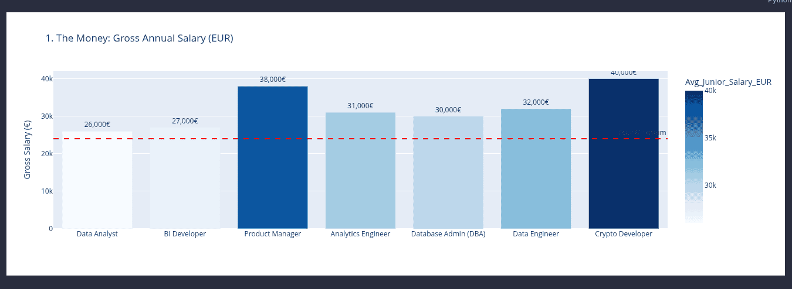
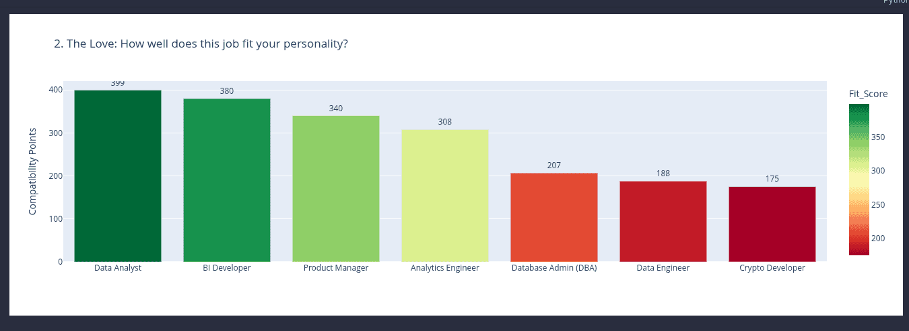
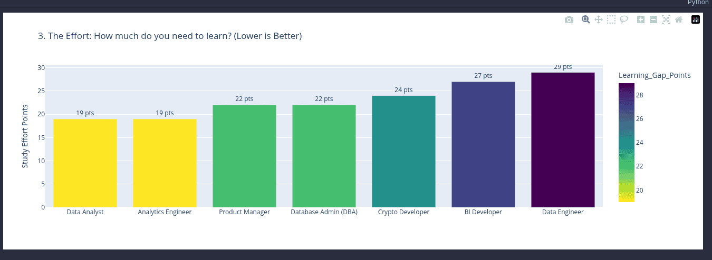
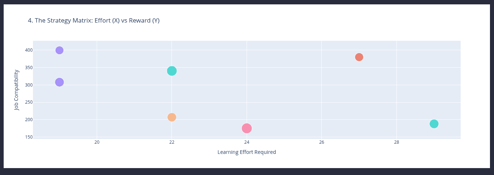
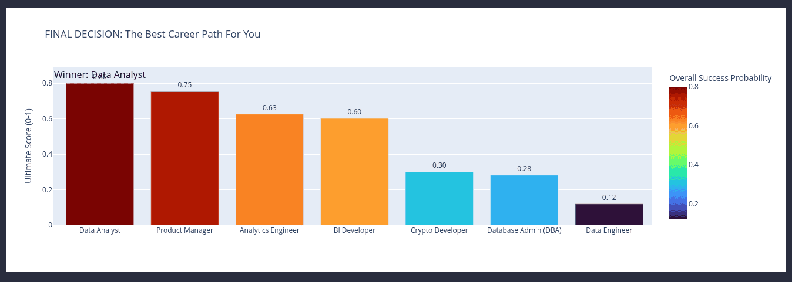

# Career Path Analysis Tool

A comprehensive Jupyter Notebook for analyzing and comparing different career paths based on multiple criteria to help you find best fit for your skills, preferences, and priorities.

## Background

This tool was created after 4 years of experience in Data Engineering, when I decided to explore career change options. I needed a systematic way to evaluate different career paths beyond just salary considerations - taking into account personal preferences, skill gaps, work-life balance, and other factors that matter for long-term career satisfaction.

The goal was to make an informed decision based on data rather than gut feelings, and this notebook helped me analyze multiple career options objectively. I'm sharing it publicly in case it helps others facing similar career decisions.

## Overview

This tool analyzes different career roles by considering multiple factors such as salary, stability, work-life balance, learning requirements, and personal preferences. It provides interactive visualizations and a weighted scoring system to help you make informed career decisions.

## Features

- **Multi-Criteria Analysis**: Evaluates roles based on 9 different attributes (stability, visual output, work-life balance, innovation, remote-friendly, math intensity, entry difficulty, customer-facing)
- **Personalized Scoring**: Adjust weights for each criterion based on your personal priorities
- **Skill Gap Analysis**: Calculates learning requirements based on your current skill levels
- **Interactive Visualizations**: 
  - Salary comparison charts
  - Job compatibility scores
  - Learning effort requirements
  - Strategy matrix (effort vs. reward)
  - Final ranking with ultimate scores
- **Customizable Priorities**: Set your own priorities for fit, money, and speed to hire

## Supported Career Roles

The tool currently analyzes following roles:
- Data Analyst
- Data Engineer
- BI Developer
- Database Admin (DBA)
- Crypto Developer
- Product Manager
- Analytics Engineer
- Technical Writer

## Requirements

- Python 3.7+
- pandas
- plotly
- Jupyter Notebook

## Installation

1. Clone this repository:
```bash
git clone <your-repo-url>
cd near-work-analysis
```

2. Install required dependencies:
```bash
pip install pandas plotly jupyter
```

## Usage

1. Open notebook:
```bash
jupyter notebook career-path-analysis.ipynb
```

2. Run all cells to execute analysis

3. Customize your preferences in "Personal Inputs" section:
   - Adjust `my_weights` to reflect what matters most to you
   - Update `my_current_skills` with your current proficiency levels (0-10)
   - Set `min_acceptable_salary` to filter roles
   - Modify `priority_*` values in Ultimate Score Calculator (must sum to 1.0)

4. Review visualizations and final ranking to see your best career matches

## How It Works

### 1. Data Definition
Career roles are defined with attributes on a scale of 1-10 (higher is better unless noted). Each role also has associated tools/technologies.

### 2. Personal Inputs
Enter your weighted preferences and current skill levels. The tool uses these to calculate personalized scores.

### 3. Scoring Algorithm
- **Fit Score**: Weighted combination of job attributes and personal preferences
- **Learning Gap**: Points representing how much you need to learn (lower is better)
- **Salary Check**: Filters roles that meet your minimum salary requirement

### 4. Normalization & Ultimate Score
All metrics are normalized to 0-1 scale, then combined using your priority weights:
- Fit Score (default: 60%)
- Salary (default: 20%)
- Speed to Hire (default: 20%)

## Key Metrics

- **Fit Score**: How well the job matches your personality and preferences
- **Salary**: Gross annual salary in EUR (Portugal market)
- **Learning Gap**: Points representing how much you need to learn (lower is better)
- **Ultimate Score**: Weighted combination of fit, salary, and speed to hire

## Customization

### Adding New Roles
To add a new career role, update `data` dictionary in "Data Definition" section with:
- Role name
- All 9 attribute scores
- Average junior salary
- Required tools in `tools_data`

### Adding New Tools
To add new tools/technologies:
1. Add to `tools_data` with associated roles
2. Add to `tool_profile` with pain (0-10) and reward (0-10) scores
3. Add to `my_current_skills` with your proficiency level

## Example Output

The notebook generates:
1. **The Money**: Bar chart of salaries for qualifying roles

2. **The Love**: Bar chart of fit scores showing job compatibility

3. **The Effort**: Bar chart of learning gap points (lower is better)

4. **The Strategy Matrix**: Scatter plot showing effort vs. reward relationship

5. **Final Decision**: Ultimate ranking with best career path highlighted


## Contributing

Contributions are welcome! Feel free to:
- Add new career roles
- Improve the scoring algorithm
- Enhance visualizations
- Fix bugs or improve documentation

## License

This project is licensed under the MIT License - see the [LICENSE](LICENSE) file for details.

## Author

Created as a personal career planning tool after 4 years in Data Engineering, seeking a data-driven approach to career transition.

## Acknowledgments

- Uses [Plotly](https://plotly.com/) for interactive visualizations
- Uses [pandas](https://pandas.pydata.org/) for data manipulation
